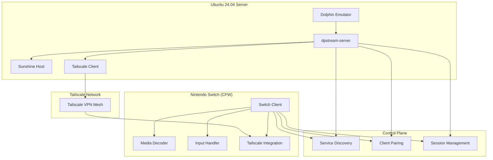
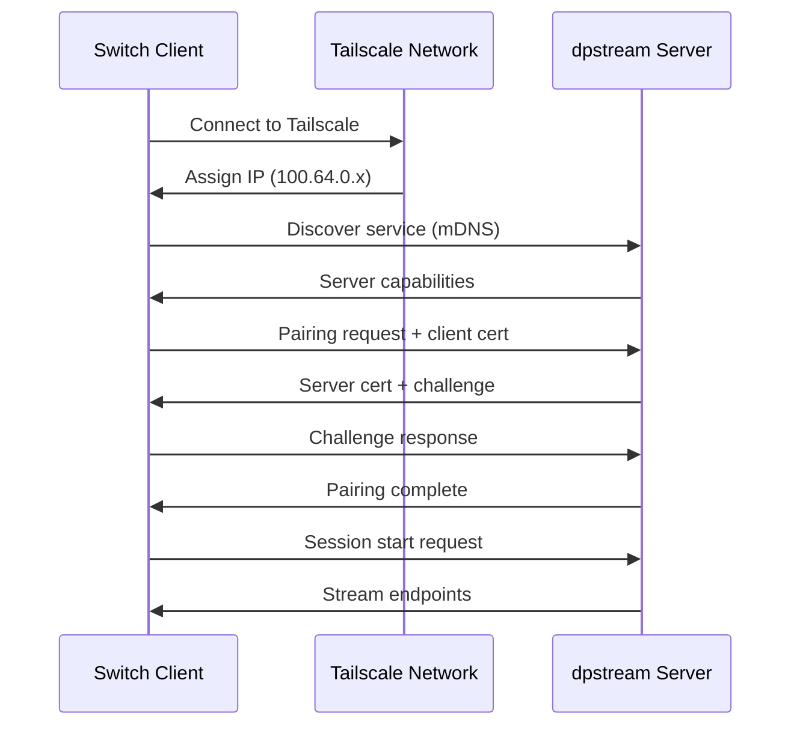

# dpstream System Architecture

## Overview

The Dolphin Remote Gaming System (dpstream) is a distributed streaming architecture that enables remote play of GameCube and Wii games from Ubuntu servers to Nintendo Switch devices over secure Tailscale VPN connections.

## High-Level Architecture



## Component Details

### Server Components

#### 1. dpstream-server (Rust)

**Responsibilities:**
- Dolphin process management
- Tailscale network integration
- GameStream protocol implementation
- Client session management
- Performance monitoring

**Key Modules:**
```rust
mod emulator {
    mod process;    // Dolphin lifecycle management
    mod config;     // Game-specific configurations
}

mod streaming {
    mod sunshine;   // Sunshine host integration
    mod capture;    // Video/audio capture
    mod encoder;    // Hardware encoding
}

mod network {
    mod vpn;        // Tailscale integration
    mod discovery;  // mDNS service advertising
    mod pairing;    // Client authentication
}
```

**Configuration:**
```toml
[server]
bind_ip = "100.64.0.1"  # Tailscale IP
port = 47989             # GameStream port
max_clients = 4

[dolphin]
executable = "/usr/bin/dolphin-emu"
rom_path = "/srv/games/gc-wii"
config_path = "/etc/dpstream/dolphin"

[streaming]
encoder = "nvenc"        # Hardware encoding
bitrate = 15000          # 15 Mbps
resolution = "1080p"
fps = 60
```

#### 2. Dolphin Emulator Integration

**Process Management:**
```rust
pub struct DolphinManager {
    process: Child,
    window_id: u64,
    config: DolphinConfig,
}

impl DolphinManager {
    pub async fn launch_game(&mut self, rom_path: &str) -> Result<()>;
    pub fn get_window_id(&self) -> Option<u64>;
    pub fn is_running(&mut self) -> bool;
    pub async fn stop_game(&mut self) -> Result<()>;
}
```

**Window Capture:**
- X11 window detection by process ID
- Screen region capture setup
- Integration with GStreamer pipeline

#### 3. Streaming Pipeline (Sunshine)

**Media Processing Flow:**
```
Dolphin Window → Screen Capture → Video Encoder → RTP Stream
                                      ↓
Audio Output → Audio Capture → Audio Encoder → RTP Stream
```

**Network Streams:**
- **Video**: UDP port 47998 (H.264/RTP)
- **Audio**: UDP port 47996 (Opus/RTP)
- **Control**: TCP port 47999 (Input/Statistics)

### Client Components (Nintendo Switch)

#### 1. Switch Homebrew Client (Rust no_std)

**Core Structure:**
```rust
#![no_std]
#![no_main]

pub struct DolphinClient {
    moonlight: MoonlightStream,
    input_handler: InputHandler,
    display: DisplayManager,
    tailscale: TailscaleClient,
}

impl DolphinClient {
    pub fn new() -> Result<Self>;
    pub fn run(&mut self);  // Main game loop
}
```

**Memory Layout:**
```
Switch Memory Map (4GB total, ~3.2GB available)
┌─────────────────────┐ 0x80000000
│   Application Code  │ ~32MB
├─────────────────────┤
│   Static Data       │ ~16MB
├─────────────────────┤
│   Video Buffers     │ ~128MB (decode surfaces)
├─────────────────────┤
│   Audio Buffers     │ ~16MB
├─────────────────────┤
│   Network Buffers   │ ~32MB
├─────────────────────┤
│   Application Heap  │ ~3GB (remaining)
└─────────────────────┘
```

#### 2. Hardware Video Decoder (Tegra X1)

**NVDEC Integration:**
```rust
pub struct HardwareDecoder {
    decoder: NvDecoder,
    surface_pool: Vec<NvFrame>,
}

impl HardwareDecoder {
    pub fn new() -> Result<Self>;
    pub fn decode_frame(&mut self, data: &[u8]) -> Result<NvFrame>;
}
```

**Supported Formats:**
- **H.264**: Up to 4K@60fps (using 1080p@60 for gaming)
- **Surface Format**: NV12 (12-bit YUV)
- **Output**: Direct to display framebuffer

#### 3. Input Processing

**Controller Mapping:**
```rust
pub struct InputMapping {
    // GameCube Controller Emulation
    pub gc_a: SwitchButton::A,
    pub gc_b: SwitchButton::X,
    pub gc_x: SwitchButton::Y,
    pub gc_y: SwitchButton::B,

    // Analog Controls
    pub gc_stick: LeftStick,
    pub gc_c_stick: RightStick,

    // Wii Remote Emulation
    pub wii_pointer: GyroToPointer,
    pub wii_motion: AccelToMotion,
}
```

**HD Rumble:**
- Frequency range: 40-1200 Hz
- Amplitude control: 8-bit precision
- Low-latency feedback (<5ms)

## Network Architecture

### Tailscale VPN Integration

**Network Topology:**
```
Internet Cloud
     │
┌────▼────┐
│ DERP    │ (Relay servers if needed)
│ Relays  │
└────┬────┘
     │
┌────▼─────────────────┐
│ Tailscale Mesh Net   │
│ 100.64.0.0/10       │
└─┬─────────────────┬──┘
  │                 │
┌─▼──────────────┐ ┌▼─────────────┐
│ Ubuntu Server  │ │ Switch Client │
│ 100.64.0.1     │ │ 100.64.0.2    │
│ Port 47989     │ │ Dynamic Ports │
└────────────────┘ └───────────────┘
```

**Connection Establishment:**
1. **Service Discovery**: mDNS broadcast on Tailscale network
2. **Client Pairing**: Certificate exchange and authentication
3. **Stream Negotiation**: Capabilities and quality settings
4. **Media Streams**: Separate UDP streams for video/audio/control

### Protocol Stack

**GameStream Protocol Implementation:**
```rust
pub enum GameStreamMessage {
    // Discovery and Pairing
    ServerInfo { hostname: String, capabilities: Vec<String> },
    PairRequest { client_cert: Vec<u8>, challenge: Vec<u8> },
    PairResponse { server_cert: Vec<u8>, success: bool },

    // Session Management
    AppList { apps: Vec<GameInfo> },
    LaunchRequest { app_id: u32, config: StreamConfig },
    LaunchResponse { session_id: String, ports: PortConfig },

    // Runtime Control
    InputData { controller_id: u8, state: ControllerState },
    QualityChange { bitrate: u32, resolution: Resolution },
    Statistics { fps: u32, latency_ms: u32, packet_loss: f32 },
}
```

## Performance Characteristics

### Target Performance Metrics

| Metric | Target | Measurement |
|--------|---------|-------------|
| **End-to-end Latency** | <30ms | Input to display |
| **Video Quality** | 1080p@60fps | H.264, 15-20 Mbps |
| **Audio Latency** | <20ms | Opus, 128kbps |
| **Network Bandwidth** | 10-25 Mbps | Adaptive bitrate |
| **Frame Drops** | <0.1% | During stable connection |
| **Memory Usage** | <256MB | Switch client |
| **CPU Usage** | <50% | Single core on server |

### Optimization Strategies

#### 1. Latency Reduction
```rust
pub struct LatencyOptimizer {
    pub frame_pacing: bool,          // Consistent frame timing
    pub predictive_input: bool,      // Input prediction
    pub immediate_encode: bool,      // Skip frame buffering
    pub priority_queuing: bool,      // Network packet priority
}
```

#### 2. Quality Adaptation
```rust
pub struct QualityController {
    current_bitrate: u32,
    target_latency: Duration,
    packet_loss_threshold: f32,

    // Adaptation levels
    quality_levels: Vec<StreamConfig>,
}

impl QualityController {
    pub fn adapt_quality(&mut self, stats: NetworkStats) -> Option<StreamConfig>;
}
```

#### 3. Network Optimization
- **Direct Connections**: Prefer direct Tailscale connections over DERP relays
- **5GHz WiFi**: Recommend 5GHz for lower latency and higher bandwidth
- **Buffer Management**: Minimize buffering for real-time performance
- **Packet Aggregation**: Combine small packets to reduce overhead

## Security Architecture

### Authentication Flow



### Data Protection

**Encryption Layers:**
1. **Transport**: TLS 1.3 for control connections
2. **Network**: WireGuard encryption via Tailscale
3. **Application**: AES-128 for media streams (GameStream standard)

**Access Control:**
- Device-based authentication via Tailscale identity
- Certificate pinning for client-server pairing
- Session tokens with expiration
- No open ports on public internet

## Deployment Architecture

### Production Deployment

```yaml
# docker-compose.yml
version: '3.8'

services:
  dpstream-server:
    image: dpstream:latest
    network_mode: host  # Required for Tailscale
    volumes:
      - /srv/games:/srv/games:ro
      - /srv/saves:/srv/saves
      - tailscale-data:/var/lib/tailscale
    environment:
      - TAILSCALE_AUTH_KEY=${TAILSCALE_AUTH_KEY}
      - DOLPHIN_PATH=/usr/bin/dolphin-emu
    devices:
      - /dev/dri:/dev/dri  # GPU access for encoding
```

### Switch Client Installation

```bash
# SD Card structure
/switch/
└── dpstream/
    ├── dpstream-client.nro    # Main homebrew app
    ├── config.toml            # Client configuration
    ├── keys/                  # Client certificates
    └── logs/                  # Debug logs
```

## Monitoring and Observability

### Metrics Collection

```rust
pub struct SystemMetrics {
    // Server metrics
    pub dolphin_fps: f32,
    pub encode_latency_ms: u32,
    pub gpu_utilization: f32,
    pub memory_usage_mb: u32,

    // Network metrics
    pub bandwidth_mbps: u32,
    pub packet_loss_rate: f32,
    pub rtt_ms: u32,
    pub jitter_ms: u32,

    // Client metrics
    pub decode_latency_ms: u32,
    pub frame_drops: u32,
    pub audio_underruns: u32,
    pub input_latency_ms: u32,
}
```

### Alerting and Diagnostics

- **Performance Alerts**: Latency > 50ms, Frame drops > 1%
- **Connection Monitoring**: Tailscale connectivity, DERP relay usage
- **Resource Monitoring**: GPU usage, memory consumption, thermal throttling
- **Debug Overlays**: Real-time metrics on Switch display

## Scalability Considerations

### Multi-Client Support

```rust
pub struct MultiClientManager {
    max_clients: usize,           // 4 clients max
    active_sessions: HashMap<String, ClientSession>,
    load_balancer: LoadBalancer,  // Future: multiple servers
}
```

### Resource Management

- **CPU Scheduling**: Dedicated cores for encoding
- **Memory Pools**: Pre-allocated buffers for streaming
- **GPU Scheduling**: Separate contexts for each client
- **Network QoS**: Bandwidth allocation per client

## Future Enhancements

### Version 2.0 Roadmap

1. **Multi-Emulator Support**
   - Citra (3DS games)
   - PPSSPP (PSP games)
   - RetroArch cores

2. **Advanced Features**
   - Save state synchronization
   - Netplay integration
   - Achievement system
   - Video recording/streaming

3. **Platform Expansion**
   - Android/iOS clients
   - Steam Deck optimization
   - Web client (WebAssembly)

### Technical Improvements

- **AI Upscaling**: Real-time DLSS/FSR integration
- **Predictive Networking**: ML-based quality adaptation
- **Edge Computing**: Distributed server deployment
- **Hardware Optimization**: Custom silicon for encoding

## References

- [Moonlight Protocol Documentation](https://github.com/moonlight-stream/moonlight-docs)
- [Tailscale Architecture](https://tailscale.com/blog/how-tailscale-works/)
- [Nintendo Switch System Architecture](https://switchbrew.org/wiki/Hardware)
- [Dolphin Emulator Technical Documentation](https://wiki.dolphin-emu.org/index.php?title=Dolphin)